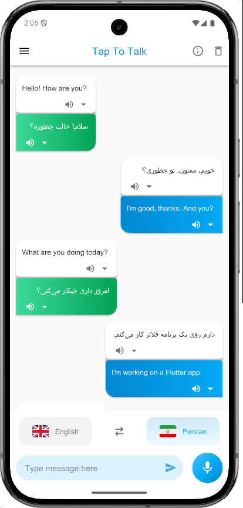
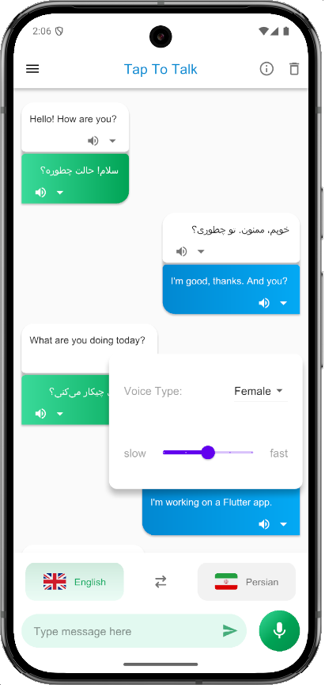
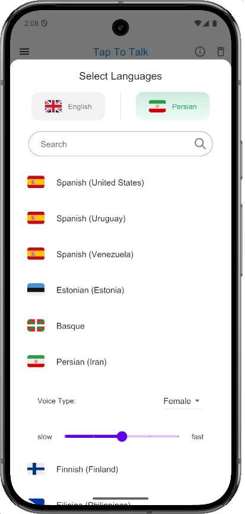
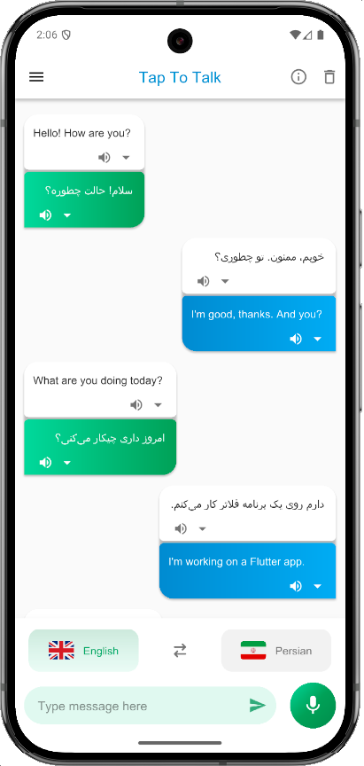
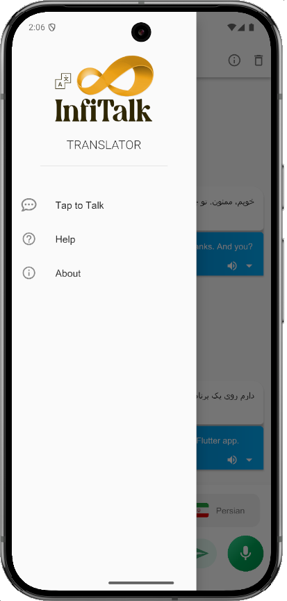

# 🎧 Real-Time Voice Translator (Flutter)

A **production Flutter app** that enables **two-way, real-time voice translation** in a chat-style interface.  
Designed for **quick, natural conversations** — press & hold to speak, **auto-transcribe → translate → speak back**, while keeping a **persistent, searchable** chat history.

---

## ✨ Features

- 🎙️ **Voice-to-Text Input**
- 🌐 **Instant Translation**
- 🔊 **Text-to-Speech Playback**
- 🔁 **Two-Way Conversation UI**
- 🌍 **Language Switcher Bottom Bar**
- 💾 **Chat History with Persistent Storage**
- 🧠 **Error & Edge Case Handling**
- 📱 **Responsive UI**

---

## 🛠️ How It Works

1. **Hold Mic** to start recording → release to stop  
2. Speech-to-Text converts voice → text  
3. Text is translated into the target language  
4. Text-to-Speech plays translated speech  
5. Messages are **persisted locally** for offline history  
6. Swap languages anytime via **bottom language switcher**

---

## 🧩 Tech Stack

### Framework
- Flutter (Dart), Material Design
- Responsive layout via `flutter_screenutil`

### State Management & DI
- **GetX** (`get`)
- Dependency injection with `Get.put`
- Reactive UI w/ `Obx` + Rx variables

### Audio
- Recording: `flutter_sound`
- Playback: `just_audio`
- TTS: `flutter_azure_tts` (Azure TTS)

### Data & Storage
- Local persistence: `hive_flutter`
- Repository pattern w/ caching

---

## 📸 Screenshots

| | |
|:-------------------------:|:-------------------------:|
|  |  |
|  |  |
|  | 

---

