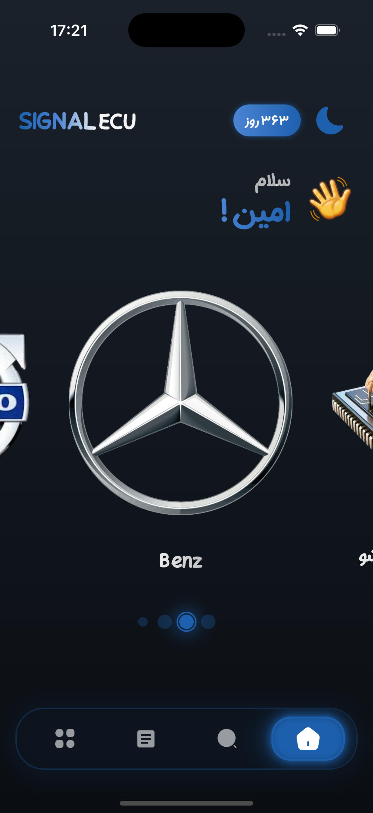
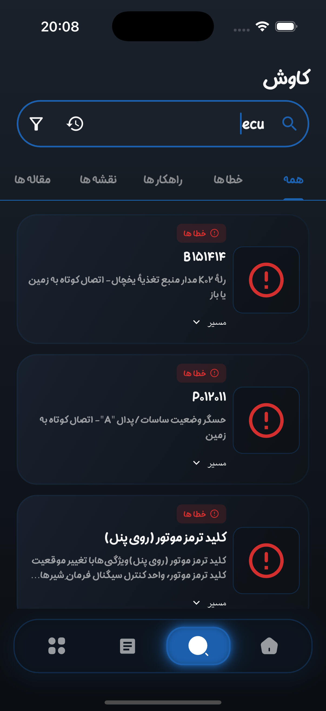
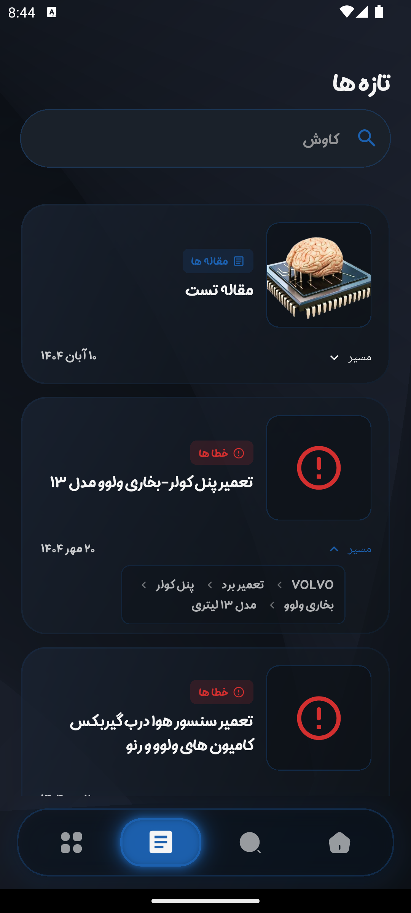
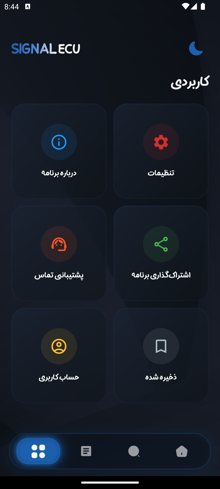
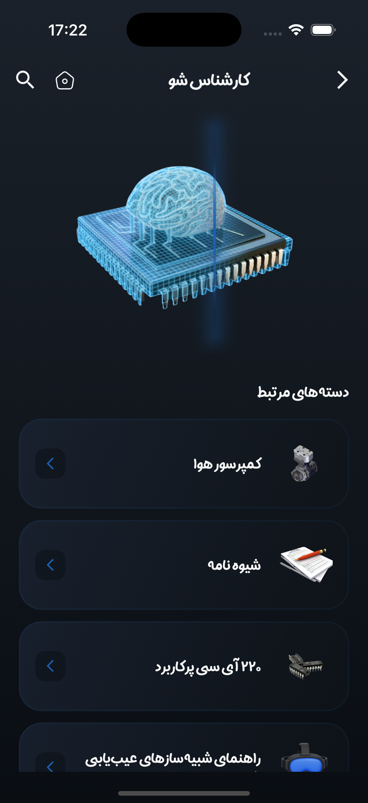
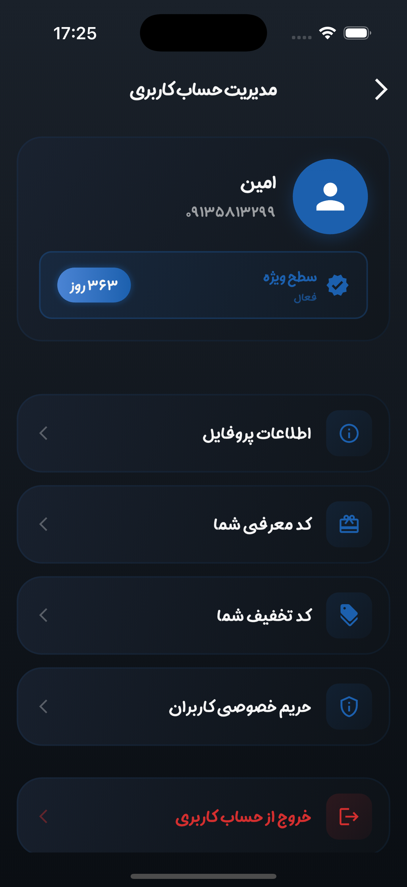
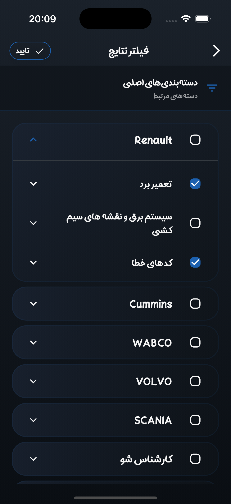
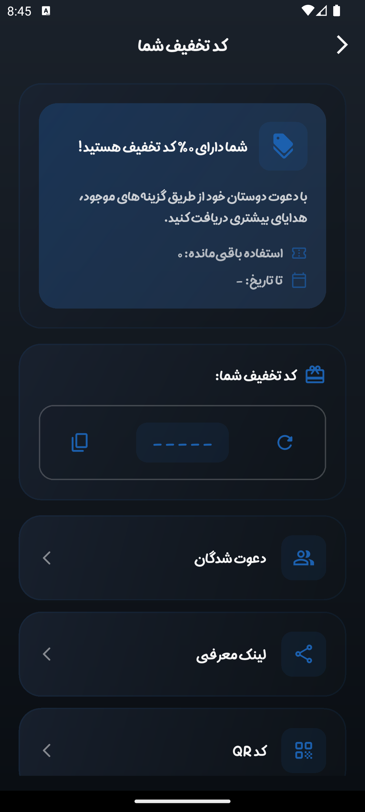
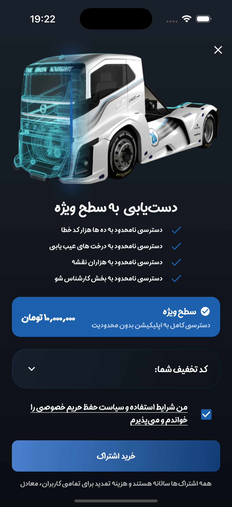

# Signal ECU 🚛 🔧

**Advanced Heavy Machinery Diagnostics & Educational Platform**

Bridging the gap between field mechanics and complex electronic control systems through intelligent diagnostics and dynamic content.

---

## 📖 Overview

Signal ECU is a specialized mobile application built with Flutter designed to assist heavy-duty truck mechanics, workshops, and automotive students in diagnosing and repairing Electronic Control Units (ECUs).

Unlike standard OBD tools that only display raw error codes, Signal ECU provides a comprehensive troubleshooting ecosystem. It combines real-time diagnostic logic with a server-driven educational content engine, guiding users from initial error detection to final repair.

The application serves as both a technical tool for professionals and a learning platform for newcomers, delivering up-to-date repair manuals, video tutorials, and schematic articles directly from the server.

    <a href="https://zaya.io/signalecu">
      
    
  

## 📸 Screenshots

| | |
|:-------------------------:|:-------------------------:|
|  |  |
|  |  |
|  |  |
|  |  |
|  | 

## ✨ Key Features

### 🛠 Smart Diagnostics & Tools
- **Intelligent Troubleshooting:** Goes beyond simple error codes by offering step-by-step diagnostic workflows based on field-tested failure patterns.
- **Interactive Schematics:** High-performance image zooming (photo_view) allows mechanics to inspect complex wiring diagrams in minute detail.
- **QR Code Integration:** Built-in scanner (qr_flutter) for quick equipment identification or linking physical manuals to digital assets.

---

### 📚 Rich Media & Server-Driven Content
- **Dynamic Rendering:** utilizes flutter_html and webview_flutter to render rich text, tables, and media directly from the backend, allowing instant content updates without app store releases.
- **Video Integration:** Seamless playback of educational content using Youtubeer_flutter and native video players.
- **Offline Caching:** Powered by hive_ce (NoSQL database) and cached_network_image to ensure diagnostic data is available even in remote areas with poor connectivity.

---

### 🔐 Security & Privacy
- **Content Protection:** Implements screen capture prevention (no_screenshot) to protect proprietary educational content and diagnostic intellectual property.
- **Secure Authentication:** Utilizes flutter_secure_storage and OTP autofill (otp_autofill) for a seamless and secure user login experience.

---

### 🌍 Global & Localized Experience
- **Persian Localization:** specialized support for the Iranian market, including Jalali Calendar integration via shamsi_date.
- **Multi-Theme UI:** Responsive design (flutter_screenutil) with robust light/dark modes and smooth animations (flutter_animate, skeletonizer) for optimal usability in diverse environments (e.g., dark repair pits vs. bright sunlight).

---

## 🏗 Technical Highlights
- **State Management & Routing:** Leverages GetX for reactive state management and AutoRoute for strongly-typed, deep-link capable navigation (app_links).
- **Code Generation:** Built with robustness in mind using freezed and json_serializable for immutable data models and type-safe API interactions.
- **Push Notifications:** Integrated Firebase Cloud Messaging and local notifications to keep mechanics updated on new courses and critical app alerts.
